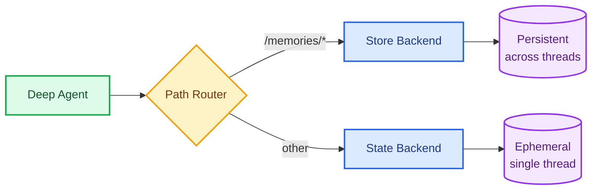

Deep Agents use their filesystem to store and retrieve information. How long that information persists depends on which [backend](/oss/javascript/deepagents/backends) you configure.

## Types of memory

Before configuring memory, it helps to understand the different kinds of information an agent can remember. For a full conceptual overview, see the [memory concepts guide](/oss/javascript/concepts/memory).

| Memory type | What is stored | Agent example |
|---|---|---|
| [Semantic](/oss/javascript/concepts/memory#semantic-memory) | Facts and knowledge | User preferences, project context |
| [Episodic](/oss/javascript/concepts/memory#episodic-memory) | Past experiences | Successful tool-call sequences, few-shot examples |
| [Procedural](/oss/javascript/concepts/memory#procedural-memory) | Instructions and rules | Self-improving system prompts |

Semantic memories can be stored as a single continuously updated [profile](/oss/javascript/concepts/memory#profile) (higher coherence, harder to maintain) or as a [collection](/oss/javascript/concepts/memory#collection) of individual documents (higher recall, easier to extend). See the [concepts guide](/oss/javascript/concepts/memory#semantic-memory) for tradeoffs.

## Short-term memory

By default, the agent's filesystem uses `StateBackend`, which stores files in the LangGraph thread state. Files persist across turns within a single conversation but are lost when the conversation ends.

This is useful for scratch work (drafts, intermediate results, working notes) that the agent doesn't need to remember later.


```typescript
import { createDeepAgent } from "deepagents";

// StateBackend is the default — no configuration needed
const agent = createDeepAgent({});
```


## Long-term memory

To persist information across conversations, use a [`CompositeBackend`](https://reference.langchain.com/javascript/deepagents/backends/CompositeBackend) that routes `/memories/` to a [`StoreBackend`](https://reference.langchain.com/javascript/deepagents/backends/StoreBackend). The agent's scratch files stay ephemeral while anything written to `/memories/` persists in a LangGraph [Store](/langsmith/custom-store).



### Setup

Configure long-term memory by using a `CompositeBackend` that routes the `/memories/` path to a `StoreBackend`:


```typescript
import { createDeepAgent } from "deepagents";
import { CompositeBackend, StateBackend, StoreBackend } from "deepagents";
import { InMemoryStore } from "@langchain/langgraph-checkpoint";

const agent = createDeepAgent({
  store: new InMemoryStore(),  // Good for local dev; omit for LangSmith Deployment
  backend: (config) => new CompositeBackend(
    new StateBackend(config),  // Short-term: ephemeral scratch space
    { "/memories/": new StoreBackend(config, {
      namespace: (ctx) => [ctx.runtime.context.userId],
    }) }  // Long-term: persists across conversations
  ),
});
```


### Namespace scoping

The `namespace` parameter on `StoreBackend` controls who can see what data. **Always set a namespace factory in production** to isolate data appropriately.

The right scope depends on who should see and modify the data. The examples below are based on an organization running two assistants (an email writing assistant and a social media drafting assistant), serving multiple users.

| Scope | Namespace | Use case | Example |
|---|---|---|---|
| **Private** (recommended default) | `(assistant_id, user_id)` | Per-user preferences within one assistant | "Sign my emails 'Best, Alex'" for the email assistant only |
| **Assistant** | `(assistant_id)` | Shared instructions for one assistant | "Cap posts at 280 characters" for the social media assistant |
| **User** | `(user_id)` | Global user profile across all assistants | User's preferred language is Spanish |
| **Organization** | `(org_id)` | Read-only policies for all users and assistants | "Never disclose internal pricing" |

<Warning>
Shared memory (assistant, user, or organization scope) is a vector for prompt injection. If one user can write to memory that another user's conversation reads, a malicious user could inject instructions into that shared state. Enforce read-only access where appropriate. For example, make organization-wide policies writable only through application code, not by the agent itself.
</Warning>

<Tabs>
  <Tab title="Private (recommended)">
    Namespace by `(assistant_id, user_id)`. Each user gets private memory within a given assistant.


```typescript
import { getConfig } from "@langchain/langgraph";
import { createDeepAgent, CompositeBackend, StateBackend, StoreBackend } from "deepagents";

const agent = createDeepAgent({
  backend: (rt) => new CompositeBackend(
    new StateBackend(rt),
    {
      "/memories/": new StoreBackend(rt, {
        namespace: (ctx) => {
          const config = getConfig();
          return [config.metadata.assistantId, ctx.runtime.context.userId];
        },
      }),
    },
  ),
  systemPrompt: `You have persistent memory at /memories/.

  Read /memories/instructions.txt at the start of each conversation for
  accumulated knowledge and preferences. When you learn something that
  should persist, update that file.`,
});
```


  </Tab>
  <Tab title="Assistant">
    Namespace by `assistant_id`. Memory is shared across all users of the same assistant, so any user can read or update it. Use this for shared instructions or knowledge that applies to everyone using a given assistant (e.g., "always reply in formal tone").


```typescript
import { getConfig } from "@langchain/langgraph";
import { createDeepAgent, CompositeBackend, StateBackend, StoreBackend } from "deepagents";

const agent = createDeepAgent({
  backend: (rt) => new CompositeBackend(
    new StateBackend(rt),
    {
      "/memories/": new StoreBackend(rt, {
        namespace: (ctx) => {
          const config = getConfig();
          return [config.metadata.assistantId];
        },
      }),
    },
  ),
});
```


  </Tab>
  <Tab title="User">
    Namespace by `user_id` alone. Memory follows the user across all assistants. Use this for a global user profile (name, timezone, communication preferences) that should apply regardless of which assistant the user is talking to.


```typescript
import { createDeepAgent, CompositeBackend, StateBackend, StoreBackend } from "deepagents";

const agent = createDeepAgent({
  backend: (rt) => new CompositeBackend(
    new StateBackend(rt),
    {
      "/memories/": new StoreBackend(rt, {
        namespace: (ctx) => [ctx.runtime.context.userId],
      }),
    },
  ),
});
```


  </Tab>
  <Tab title="Organization">
    Namespace by `org_id`. Memory is shared across all users and all assistants. Typically used for organization-wide policies (compliance rules, brand guidelines) that should be read-only for the agent. Write access should be restricted to application code to prevent prompt injection.


```typescript
import { createDeepAgent, CompositeBackend, StateBackend, StoreBackend } from "deepagents";

const agent = createDeepAgent({
  backend: (rt) => new CompositeBackend(
    new StateBackend(rt),
    {
      "/memories/": new StoreBackend(rt, {
        namespace: (ctx) => [ctx.runtime.context.orgId],
      }),
    },
  ),
});
```


  </Tab>
</Tabs>

For the full namespace factory API, see [namespace factories](/oss/javascript/deepagents/backends#namespace-factories).

### Cross-thread persistence

Files in `/memories/` can be accessed from any thread:


```typescript
import { v4 as uuidv4 } from "uuid";

// Thread 1: Write to long-term memory
const config1 = { configurable: { thread_id: uuidv4() } };
await agent.invoke({
  messages: [{ role: "user", content: "Save my preferences to /memories/preferences.txt" }],
}, config1);

// Thread 2: Read from long-term memory (different conversation!)
const config2 = { configurable: { thread_id: uuidv4() } };
await agent.invoke({
  messages: [{ role: "user", content: "What are my preferences?" }],
}, config2);
// Agent can read /memories/preferences.txt from the first thread
```


### Path routing

The `CompositeBackend` routes file operations based on path prefixes:
- Files with paths starting with `/memories/` are stored in the Store (persistent)
- Files without this prefix remain in transient state
- All filesystem tools (`ls`, `read_file`, `write_file`, `edit_file`) work with both

<Note>
`CompositeBackend` strips the route prefix before storing. For example, `/memories/preferences.txt` is stored as `/preferences.txt` in the `StoreBackend`. The agent always uses the full path. See [CompositeBackend](/oss/javascript/deepagents/backends#compositebackend-router) for details.
</Note>

## Accessing memories from external code

If deploying your agent on [LangSmith Deployment](/langsmith/deployment), you can read or write memories from server-side code (outside the agent) using the [Store API](/langsmith/custom-store). The namespace you use must match the one configured in your `StoreBackend` [namespace factory](/oss/javascript/deepagents/backends#namespace-factories). The examples below use the default legacy namespace `(assistant_id, "filesystem")`.


```typescript
import { Client } from "@langchain/langgraph-sdk";

const client = new Client({ apiUrl: "<DEPLOYMENT_URL>" });

// Read a memory file (path without /memories/ prefix)
const item = await client.store.getItem(
  [assistantId, "filesystem"],
  "/preferences.txt"
);

// Write a memory file
await client.store.putItem(
  [assistantId, "filesystem"],
  "/preferences.txt",
  {
    content: ["line 1", "line 2"],
    created_at: "2024-01-15T10:30:00Z",
    modified_at: "2024-01-15T10:30:00Z"
  }
);

// Search for items
const items = await client.store.searchItems([assistantId, "filesystem"]);
```


<Note>
When using `CompositeBackend`, the key does not include the `/memories/` prefix because the route prefix is stripped before storing. See [Path routing](#path-routing) for details.
</Note>

For more information, see the [Store API reference](/langsmith/custom-store).

## Common patterns

The examples below assume you have already configured a `CompositeBackend` with a `/memories/` route as shown in [Setup](#setup). They focus on the system prompt and file structure for each pattern.

### Self-improving instructions

The agent reads and updates an instructions file based on user feedback. This is the most common pattern, combining user preferences and procedural memory into a single file.

```
/memories/instructions.txt    # Accumulated preferences and rules
```

```
You have persistent memory at /memories/.

Read /memories/instructions.txt at the start of each conversation for
accumulated knowledge and preferences.

When users provide feedback like "please always do X" or "I prefer Y",
update /memories/instructions.txt using the edit_file tool.
```

Over time, the instructions file accumulates user preferences, helping the agent improve without any external orchestration.

### Knowledge base

The agent builds up structured knowledge across conversations, organized by topic.

```
/memories/projects/webapp/stack.txt       # Technology choices
/memories/projects/webapp/decisions.txt   # Architecture decisions
/memories/contacts/team.txt               # Team members and roles
```

```
You have persistent memory at /memories/.

When you learn facts about the user's projects, team, or domain,
save them to organized files under /memories/. Use subdirectories
to group related information.

At the start of each conversation, check /memories/ for relevant
context before asking the user to repeat themselves.
```

### Research projects

The agent maintains research state across sessions with a clear file structure.

```
/memories/research/sources.txt    # List of sources found
/memories/research/notes.txt      # Key findings and notes
/memories/research/report.md      # Final report draft
```

```
You are a research assistant.

Save your research progress to /memories/research/:
- /memories/research/sources.txt — list of sources found
- /memories/research/notes.txt — key findings and notes
- /memories/research/report.md — final report draft

This allows research to continue across multiple sessions.
```

## Store implementations

Any LangGraph `BaseStore` implementation works. When deploying to [LangSmith Deployment](/langsmith/deployment), the platform provisions a store automatically.

### InMemoryStore (development)

Good for testing and development, but data is lost on restart:


```typescript
import { InMemoryStore } from "@langchain/langgraph-checkpoint";

const store = new InMemoryStore();
```


### PostgresStore (production)

For production, use a persistent store:


```typescript
import { PostgresStore } from "@langchain/langgraph-checkpoint-postgres";

const store = new PostgresStore({
  connectionString: process.env.DATABASE_URL,
});
```


Pass the store to `create_deep_agent` along with your backend configuration from [Setup](#setup).

<Accordion title="FileData schema">

Files stored via `StoreBackend` use the following schema:

```python
{
    "content": ["line 1", "line 2", "line 3"],  # List of strings (one per line)
    "created_at": "2024-01-15T10:30:00Z",       # ISO 8601 timestamp
    "modified_at": "2024-01-15T11:45:00Z"       # ISO 8601 timestamp
}
```

You can use the `create_file_data` helper to create properly formatted file data:


```typescript
import { createFileData } from "deepagents";

const fileData = createFileData("Hello\nWorld");
// { content: ['Hello', 'World'], created_at: '...', modified_at: '...' }
```


For more details on backend protocols, see [Backends](/oss/javascript/deepagents/backends#protocol-reference).

</Accordion>

## Best practices

### Always set a namespace in production

Without a namespace factory, all users share the same memory space. Use [namespace scoping](#namespace-scoping) to isolate data. Start with the **private** scope `(assistant_id, user_id)` unless you have a specific reason to share.

### Use descriptive paths

Organize persistent files with clear, hierarchical paths:

```
/memories/instructions.txt
/memories/research/topic_a/sources.txt
/memories/research/topic_a/notes.txt
/memories/project/requirements.md
```

### Document the memory structure in your system prompt

Tell the agent what's stored where so it knows how to use its memory:

```
Your persistent memory structure:
- /memories/instructions.txt: Your accumulated preferences and rules
- /memories/context/: Long-term context about the user
- /memories/knowledge/: Facts and information learned over time
```

### Choose when to write memories

Memories can be updated [in the hot path](/oss/javascript/concepts/memory#in-the-hot-path) (during the conversation, with immediate availability but added latency) or [in the background](/oss/javascript/concepts/memory#in-the-background) (asynchronously, with no latency impact but delayed availability). For most Deep Agents, hot-path writing via the filesystem tools is the simplest approach.

### Prune old data

Implement periodic cleanup of outdated persistent files to keep storage manageable. Consider adding instructions to your system prompt for the agent to consolidate or archive old files.

### Choose the right store

- **Development**: Use `InMemoryStore` for quick iteration
- **Production**: Use `PostgresStore` or other persistent stores
- **LangSmith Deployment**: The platform provisions a store automatically

---

<div className="source-links">
<Callout icon="edit">
    [Edit this page on GitHub](https://github.com/langchain-ai/docs/edit/main/src/oss/deepagents/long-term-memory.mdx) or [file an issue](https://github.com/langchain-ai/docs/issues/new/choose).
</Callout>
<Callout icon="terminal-2">
    [Connect these docs](/use-these-docs) to Claude, VSCode, and more via MCP for real-time answers.
</Callout>
</div>
