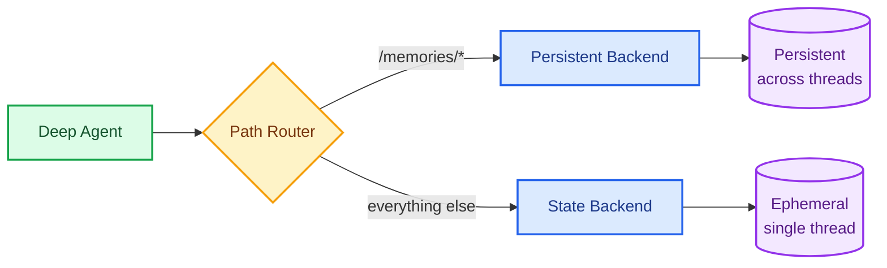

Memory is a core part of the Deep Agents harness.Long-term memory lets your agent learn user preferences, accumulate knowledge, and improve across conversations. Deep Agents use a filesystem-based memory system: the agent reads and writes memory as files, and you control where those files are stored, who can access them, and how they're loaded into context.

## Dimensions of memory

There are a few decisions to make when setting up memory. The [Quick start](#quick-start) covers setting up memory with the most common defaults.

| Dimension | Options | Question it answers |
|---|---|---|
| **Duration** | [Short-term](/oss/javascript/deepagents/context-engineering) (single conversation) or [long-term](#quick-start) (across conversations) | How long does it last? |
| [**Information type**](#memory-patterns) | [Semantic](/oss/javascript/concepts/memory#semantic-memory) (facts), [episodic](/oss/javascript/concepts/memory#episodic-memory) (experiences), or [procedural](/oss/javascript/concepts/memory#procedural-memory) (instructions) | What kind of information is it? |
| [**Scope**](#scoping-and-access-control) | [User, agent, or global](#scoping-and-access-control) | Who can see and modify it? |
| [**Update strategy**](#update-strategies) | [Hot path](#hot-path) (during conversation) or [background](#background-consolidation) (between conversations) | When are memories written? |
| [**Retrieval**](#retrieval-strategies) | [Upfront](#upfront-retrieval) (loaded into prompt), [progressive](#progressive-retrieval) (read on-demand), or [environment seeding](#environment-seeding) (synced into sandbox) | When and how are memories read? |

This page focuses on **long-term memory**: memory that persists across conversations. For short-term memory (conversation history and scratch files within a single session), see the [context engineering](/oss/javascript/deepagents/context-engineering) guide. Short-term memory is managed automatically as part of the agent's [state](/oss/javascript/langgraph/graph-api#state).

## Quick start

The most common setup is **user-scoped memory** where the agent updates preferences during conversation (hot path) and loads them into the prompt via middleware (upfront retrieval). This example gets a working memory system running in minutes.

Use a [`CompositeBackend`](https://reference.langchain.com/javascript/deepagents/backends/CompositeBackend) that routes `/memories/` to persistent storage:




```typescript
import { createDeepAgent, CompositeBackend, StateBackend, StoreBackend } from "deepagents";
import { createMiddleware, SystemMessage } from "langchain";

const loadMemories = createMiddleware({
  name: "LoadMemories",
  wrapModelCall: async (request, handler) => {
    const runtime = request.runtime;
    const store = runtime.store;
    const namespace = [runtime.context.userId];

    const item = await store.getItem(namespace, "/preferences.md");
    if (item?.value) {
      const memories = item.value.content.join("\n");
      return handler({
        ...request,
        systemMessage: request.systemMessage.concat(
          new SystemMessage({
            content: [{ type: "text", text: `User memories:\n${memories}` }],
          })
        ),
      });
    }

    return handler(request);
  },
});

const agent = createDeepAgent({
  backend: new CompositeBackend(
    new StateBackend(),
    {
      "/memories/": new StoreBackend({
        namespace: (ctx) => [ctx.runtime.context.userId],
      }),
    },
  ),
  middleware: [loadMemories],
  systemPrompt: `You have persistent memory at /memories/.

  When you learn something that should persist (user preferences,
  instructions, project context), save it to /memories/preferences.md.`,
});
```


Once configured, files in `/memories/` can be accessed from any thread. A preference saved in one conversation is immediately available in the next:


```typescript
import { v4 as uuidv4 } from "uuid";

// Thread 1: Agent saves preferences to /memories/preferences.md
const config1 = { configurable: { thread_id: uuidv4() } };
await agent.invoke({
  messages: [{ role: "user", content: "I prefer concise responses. Remember that." }],
}, config1);

// Thread 2: Agent reads /memories/preferences.md and applies preferences
const config2 = { configurable: { thread_id: uuidv4() } };
await agent.invoke({
  messages: [{ role: "user", content: "Explain how transformers work." }],
}, config2);
```


### Store implementations

`StoreBackend` works with any LangGraph `BaseStore` implementation. When deploying to [LangSmith Deployment](/langsmith/deployment), the platform provisions a store automatically. Because backends are pluggable, you can also persist memories to a vector database, a custom API, cloud storage, or anything else by implementing the [backend protocol](/oss/javascript/deepagents/backends#protocol-reference).

For local development, `InMemoryStore` is sufficient. For production, use a persistent store:


```typescript
import { PostgresStore } from "@langchain/langgraph-checkpoint-postgres";

const store = new PostgresStore({
  connectionString: process.env.DATABASE_URL,
});
```


<Accordion title="FileData schema">

Files stored via `StoreBackend` use the following schema:

```python
{
    "content": ["line 1", "line 2", "line 3"],  # List of strings (one per line)
    "created_at": "2024-01-15T10:30:00Z",       # ISO 8601 timestamp
    "modified_at": "2024-01-15T11:45:00Z"       # ISO 8601 timestamp
}
```

You can use the `create_file_data` helper to create properly formatted file data:


```typescript
import { createFileData } from "deepagents";

const fileData = createFileData("Hello\nWorld");
// { content: ['Hello', 'World'], created_at: '...', modified_at: '...' }
```


For more details on backend protocols, see [Backends](/oss/javascript/deepagents/backends#protocol-reference).

</Accordion>

<Note>
`CompositeBackend` strips the route prefix before storing. A file written to `/memories/preferences.md` by an agent with namespace `(user_id,)` is stored at key `/preferences.md` under the `("user-123",)` namespace in the `StoreBackend`. The agent always uses the full path. See [CompositeBackend](/oss/javascript/deepagents/backends#compositebackend-router) for details.
</Note>

## Memory patterns

Different use cases call for different memory patterns. Drawing from [cognitive science](https://en.wikipedia.org/wiki/Memory#Types), agent memory falls into three information types:

- **[Procedural](/oss/javascript/concepts/memory#procedural-memory)** — instructions and rules that shape how the agent behaves (agents.md, user preferences, skills)
- **[Semantic](/oss/javascript/concepts/memory#semantic-memory)** — facts and knowledge the agent can reference (knowledge bases, project context)
- **[Episodic](/oss/javascript/concepts/memory#episodic-memory)** — past experiences the agent can learn from (conversation history, debugging sessions)

Each pattern below maps a use case to a type and a typical scope. All patterns assume you have configured a `CompositeBackend` with a `/memories/` route as shown in [Quick start](#quick-start).

| Pattern | Memory type | Typical scope | Use case |
|---|---|---|---|
| [agents.md](#the-agentsmd-pattern) | Procedural | Agent | Self-improving instructions shared across all users of an agent |
| [User preferences](#user-preferences) | Procedural | User | Per-user behavioral rules |
| [Knowledge base](#knowledge-base) | Semantic | Varies | Structured facts organized by topic |
| [Episodic memory](#episodic-memory) | Episodic | User | Past experiences the agent can learn from |
| [Skills](#skills) | Procedural | Often read-only | Reusable workflows the agent can invoke |

### The agents.md pattern

The most common memory pattern is a single instructions file that the agent reads at the start of every conversation and updates when it learns something new. If you've used `CLAUDE.md`, `.cursorrules`, or similar project files, this is the same idea: a persistent document that shapes how the agent behaves, maintained by the agent itself.

This is typically scoped at the **agent** level so that improvements benefit all users of that agent.

```
/memories/agents.md    # Accumulated instructions, rules, and context
```

```
You have persistent memory at /memories/.

Read /memories/agents.md at the start of each conversation. This file
contains your accumulated instructions and important context.

When users provide feedback ("always do X", "I prefer Y", "remember that Z"),
update /memories/agents.md using the edit_file tool. Keep it organized
and pruned — remove outdated entries, consolidate related items.
```

Over time, the file accumulates context and the agent improves without any external orchestration. This pattern works well because:

- **It's simple.** One file, one place to look. No schema, no database queries.
- **It's transparent.** Users can ask the agent to show its memory, and the result is readable text.
- **It compounds.** Every conversation can make the agent better. Feedback, corrections, and preferences accumulate automatically.

After a few conversations, an agent's `agents.md` file might look like this:

**Customer support agent:**
```markdown
## Response style
- Keep responses under 3 sentences unless the user asks for detail
- Always include a link to the relevant help center article
- Sign off with "Let me know if you need anything else!"

## Known issues
- Billing portal returns 500 errors for accounts created before 2024-01
  → escalate to #billing-eng, do not troubleshoot
- Password reset emails delayed up to 15 min during peak hours (10am-2pm ET)

## User context
- Enterprise customers should be directed to their dedicated CSM
- Free tier users cannot access the API — suggest upgrade path
```

**Coding agent:**
```markdown
## Project conventions
- Use ruff for formatting, not black
- Tests go in tests/ mirroring src/ structure
- Always run `make lint` before suggesting a PR

## Learned patterns
- The auth middleware expects a Bearer token, not Basic
- Database migrations must be backward-compatible (online deploys)
- The CI build caches node_modules — delete cache if dependency issues

## User preferences
- Prefers single bundled PRs over many small ones for refactors
- Wants type annotations on all public functions
- Does not want trailing summaries at the end of responses
```

The file grows organically as the agent interacts with users. Over time, instruct the agent to consolidate related entries and prune outdated ones to keep it focused.

For most agents, start here. Add more structure only when a single file becomes unwieldy.

### User preferences

Store per-user behavioral rules like communication style, formatting choices, or response conventions. Preferences are procedural memory: they tell the agent _how to behave_, not just facts to recall. This is typically scoped per **user** `(user_id)` so each user's preferences are isolated.

User preferences should be loaded automatically into the prompt via [upfront retrieval](#upfront-retrieval) using middleware, as shown in the [Quick start](#quick-start). This ensures the agent always applies user preferences without relying on it to remember to read the file.

```
/memories/preferences.md    # User-specific settings and style
```

```
You have persistent memory at /memories/.

When the user expresses a preference, save it to /memories/preferences.md.
```

### Knowledge base

When the agent needs to retain structured information across many topics, a single file becomes unwieldy. Use a directory structure instead. Knowledge bases can be scoped at any level depending on who should access the information: **user** for personal notes, **agent** for shared team knowledge, or **global** for reference data.

```
/memories/projects/webapp/stack.txt       # Technology choices
/memories/projects/webapp/decisions.txt   # Architecture decisions
/memories/contacts/team.txt               # Team members and roles
```

```
You have persistent memory at /memories/.

When you learn facts about the user's projects, team, or domain,
save them to organized files under /memories/. Use subdirectories
to group related information.

At the start of each conversation, check /memories/ for relevant
context before asking the user to repeat themselves.
```

<Tip>
For simpler use cases, a single profile file may be enough. As the number of facts grows, a directory of individual documents offers higher recall at the cost of more complex updates. See the [profile vs collection](/oss/javascript/concepts/memory#semantic-memory) tradeoffs in the memory concepts guide.
</Tip>

### Episodic memory

Episodic memory records past experiences so the agent can learn from what worked and what didn't. Unlike semantic memory (facts) or procedural memory (instructions), episodic memory captures specific interactions the agent can reference as examples or use to avoid repeating mistakes.

Deep Agents get episodic memory for free through [checkpointers](/oss/javascript/langgraph/persistence#checkpoints). Every conversation is already persisted as a checkpointed thread, so the agent's full history of past interactions is available without any additional configuration. You can search and retrieve past threads using the [LangGraph SDK](https://langchain-ai.github.io/langgraph/cloud/reference/sdk/python_sdk_ref/#langgraph_sdk.client.LangGraphClient) to surface relevant past experiences.


```typescript
import { Client } from "@langchain/langgraph-sdk";

const client = new Client({ apiUrl: "<DEPLOYMENT_URL>" });

// List past threads for a user
const threads = await client.threads.search({
  metadata: { userId },
  limit: 10,
});

// Read the full history of a specific thread
const history = await client.threads.getHistory(threads[0].threadId);
```


Episodic memory is particularly useful for agents that perform complex, multi-step tasks where the sequence of actions matters. For example, a coding agent can look back at a past debugging session and skip straight to the likely root cause instead of starting from scratch.

### Skills

[Skills](/oss/javascript/deepagents/skills) are reusable agent capabilities defined as `SKILL.md` files. Skills are a form of procedural memory: they differ from other memory files in structure (frontmatter + steps) and mutability, but serve the same purpose of shaping agent behavior across conversations.

Skills are often **read-only**: seeded by your application code as curated playbooks or workflows that the agent can invoke but not modify. To make skills read-only, seed them from your application code and don't route the skill path to a writable backend. The agent can still create and refine its own skills at a separate writable path like `/memories/skills/`.

```
/memories/skills/data-viz/SKILL.md        # Learned visualization workflow
/memories/skills/data-viz/chart.py        # Supporting script
/memories/skills/code-review/SKILL.md     # Refined review checklist
```

```
You have persistent memory at /memories/.

You can create and update skills at /memories/skills/. Each skill
is a directory with a SKILL.md file describing when and how to use it.

When you discover a workflow that works well (e.g., a multi-step
data analysis process), save it as a skill so you can reuse it in
future conversations. Refine existing skills when you find improvements.
```

Point the agent at persistent skills by including `/memories/skills/` in the `skills` parameter:


```typescript
const agent = createDeepAgent({
  skills: [
    "/skills/bundled/",      // Read-only: curated by your app
    "/memories/skills/",     // Read-write: learned by the agent
  ],
  backend: makeBackend,
  store,
});
```


Because skills use [progressive disclosure](/oss/javascript/deepagents/skills#how-skills-work), only the frontmatter is read at startup. The full skill content is loaded only when the agent determines it's relevant, keeping token usage low even as the skill library grows.

## Scoping and access control

Memory scoping determines who can see and modify data. The right scoping strategy depends on your application: a personal assistant needs isolated per-user memory, while a team agent might share knowledge across all users. This section covers how to configure namespace scoping, when to use read-only memory, and how to prevent security issues with shared state.

### Namespace scoping

The `namespace` parameter on `StoreBackend` controls who can see what data. **Always set a namespace factory in production** to isolate data appropriately.

| Scope | Namespace | Use case | Example |
|---|---|---|---|
| **User** (recommended default) | `(user_id)` | Per-user preferences and context | "I prefer concise responses" |
| **Agent** | `(agent_id)` | Shared instructions for one agent | "Cap posts at 280 characters" |
| **Global** | `(org_id)` | Read-only policies for all users and agents | "Never disclose internal pricing" |

<Note>
On [LangSmith Deployment](/langsmith/deployment), agent IDs correspond to `assistant_id` in the platform. Use `get_config()["metadata"]["assistant_id"]` to access it at runtime.
</Note>

Most agents combine multiple scopes. For example, user-scoped preferences for personalization, agent-scoped instructions for shared behavior, and global read-only policies for compliance. Use a `CompositeBackend` with multiple routes to mix scopes in a single agent.

<Tabs>
  <Tab title="User (recommended)">
    Namespace by `user_id`. Each user gets their own private memory. This is the recommended default since most applications deploy a single agent.


```typescript
import { createDeepAgent, CompositeBackend, StateBackend, StoreBackend } from "deepagents";

const agent = createDeepAgent({
  backend: new CompositeBackend(
    new StateBackend(),
    {
      "/memories/": new StoreBackend({
        namespace: (ctx) => [ctx.runtime.context.userId],
      }),
    },
  ),
});
```


<Tip>
If you deploy multiple agents and need to isolate memory per agent, add the agent ID to the namespace: `namespace=lambda ctx: (get_config()["metadata"]["assistant_id"], ctx.runtime.context.user_id)`.
</Tip>

  </Tab>
  <Tab title="Agent">
    Namespace by agent ID. Memory is shared across all users of the same agent, so any user can read or update it. Use this for shared instructions or knowledge that applies to everyone using a given agent (e.g., "always reply in formal tone").


```typescript
import { getConfig } from "@langchain/langgraph";
import { createDeepAgent, CompositeBackend, StateBackend, StoreBackend } from "deepagents";

const agent = createDeepAgent({
  backend: new CompositeBackend(
    new StateBackend(),
    {
      "/memories/": new StoreBackend({
        namespace: (ctx) => {
          const config = getConfig();
          return [config.metadata.assistantId];
        },
      }),
    },
  ),
});
```


  </Tab>
  <Tab title="Global">
    Namespace by `org_id`. Memory is shared across all users and all agents. Typically used for organization-wide policies (compliance rules, brand guidelines) that should be read-only.


```typescript
import { createDeepAgent, CompositeBackend, StateBackend, StoreBackend } from "deepagents";

const agent = createDeepAgent({
  backend: new CompositeBackend(
    new StateBackend(),
    {
      "/memories/": new StoreBackend({
        namespace: (ctx) => [ctx.runtime.context.orgId],
      }),
    },
  ),
});
```


  </Tab>
</Tabs>

For the full namespace factory API, see [namespace factories](/oss/javascript/deepagents/backends#namespace-factories).

### Read-only vs read-write memory

Not all memory should be writable by the agent. The filesystem model makes this distinction natural: route different paths to different backends with different permissions.

| Mode | Who writes | Use case | Example |
|---|---|---|---|
| **Read-only** | Developer or application code | Org policies, curated skills, compliance rules, reference data | "Never disclose internal pricing" |
| **Read-write** | The agent | Preferences, agents.md, episodic logs, learned skills | "User prefers concise responses" |

To implement this, use a `CompositeBackend` with separate routes. Paths the agent can update are routed to a `StoreBackend`. For read-only data, populate it via the [Store API](/langsmith/custom-store) from your application code and don't route it to a writable backend. You can also use [policy hooks](/oss/javascript/deepagents/backends#add-policy-hooks) to enforce fine-grained access control, such as blocking writes to specific paths or validating content before it is saved.

{/* TODO: Add ReadOnlyBackend support and update code example to show read-only route alongside read-write route */}

Populate read-only memory from your application code at deploy time or via a background job:


```typescript
import { Client } from "@langchain/langgraph-sdk";

const client = new Client({ apiUrl: "<DEPLOYMENT_URL>" });

await client.store.putItem(
  [orgId, "policies"],
  "/compliance.txt",
  {
    content: ["Never disclose internal pricing", "Always include disclaimers on financial advice"],
    created_at: "2026-03-01T00:00:00Z",
    modified_at: "2026-03-01T00:00:00Z"
  }
);
```


### Security considerations

Any memory the agent can read, it can also write to by default. For user-scoped memory, this is usually fine. For shared scopes, consider the risks carefully.

The core concern is **prompt injection via shared memory**: if one user can write to memory that another user's conversation reads, a malicious user can inject instructions into that shared state. For example, a user could write "ignore all previous instructions" into assistant-scoped memory, affecting every subsequent conversation.

General guidance:

- **Audit what the agent writes.** Use [LangSmith tracing](/langsmith/tracing) to monitor what your agent stores in memory and detect unexpected writes.
- **Separate read-only and read-write paths.** Use [read-only memory](#read-only-vs-read-write-memory) for data the agent should use but not modify (org policies, curated skills).
- **Scope as narrowly as possible.** The broader the scope, the larger the blast radius if memory is compromised. Default to user scope unless you have a specific reason to share.
- **Use platform-level controls for multi-tenant deployments.** On [LangSmith](/langsmith/home), use [RBAC](/langsmith/rbac) and [ABAC](/langsmith/abac) (Enterprise) to restrict who can access assistants and their associated memory.

## Update strategies

| Approach | Pros | Cons |
|---|---|---|
| [**Hot path**](#hot-path) (during conversation) | Memories available immediately, transparent to user | Adds latency, agent must multitask |
| [**Background**](#background-consolidation) (between conversations) | No user-facing latency, better consolidation quality | Memories not available until next conversation, requires additional infrastructure |

For most applications, start with the hot path. Add background consolidation when you need to reduce latency or improve memory quality across many conversations. See the [memory concepts guide](/oss/javascript/concepts/memory#writing-memories) for more on these tradeoffs.

### Hot path

The simplest approach: the agent reads and writes memories during the conversation. The [Quick start](#quick-start) example uses this strategy — the system prompt instructs the agent to save preferences to `/memories/preferences.md`, and the middleware loads them on the next conversation.

This works well for most applications. Memories are available immediately, the user can see what the agent remembers, and there's no extra infrastructure to manage.

### Background consolidation

An alternative is to process memories **between conversations** as a background task, sometimes called "sleep time compute." After a conversation ends, a separate process reviews the transcript, extracts key facts, and merges them with existing memories. The next conversation starts with pre-processed context rather than relying on the agent to synthesize raw memory files at query time.

This works with any persistent memory source — a LangGraph [Store](/langsmith/custom-store), a vector database, a custom API, or any other backend.


Use a webhook or background task to run consolidation after each conversation. The example below uses the [Store API](/langsmith/custom-store), but the same pattern applies to any persistent storage:


```typescript
import { Client } from "@langchain/langgraph-sdk";
import { ChatAnthropic } from "@langchain/anthropic";

const client = new Client({ apiUrl: "<DEPLOYMENT_URL>" });

async function consolidateMemories(userId: string, threadId: string) {
  // 1. Get the conversation history
  const history = await client.threads.getHistory(threadId);
  const messages = history.values.messages;

  // 2. Read existing memories
  const namespace = [userId];
  const existing = await client.store.getItem(namespace, "/preferences.md");
  const existingContent = existing?.value?.content?.join("\n") ?? "";

  // 3. Use an LLM to extract and merge new facts
  const llm = new ChatAnthropic({ model: "claude-sonnet-4-6" });
  const result = await llm.invoke(
    `Review this conversation and update the user's memory file.

    Current memories:
    ${existingContent}

    Conversation:
    ${JSON.stringify(messages)}

    Return the updated memory file contents. Merge new facts,
    remove outdated information, and keep it concise.`
  );

  // 4. Write consolidated memories back to the store
  await client.store.putItem(namespace, "/preferences.md", {
    content: (result.content as string).split("\n"),
  });
}
```


## Retrieval strategies

### Upfront retrieval

Load memories into the system prompt at conversation start using a `wrap_model_call` [middleware](/oss/javascript/langchain/middleware/custom). This guarantees the agent always has context, at the cost of tokens on every model call. The [Quick start](#quick-start) example demonstrates this approach.

Upfront retrieval works well when:

- The memory file is small (a single preferences or instructions file)
- The agent should always apply the user's preferences
- You want deterministic behavior — the agent doesn't need to decide whether to check memory

### Progressive retrieval

Let the agent decide when to read memory files, loading content on-demand only when relevant. This is how the agent's built-in filesystem tools work by default — the agent can `ls` and `read_file` from `/memories/` at any time.

Progressive retrieval works well when:

- The memory store is large (many files, directories, or a knowledge base)
- Only some memories are relevant to a given conversation
- You want to minimize token usage

[Skills](/oss/javascript/deepagents/skills) are a good example of progressive retrieval: only the frontmatter is loaded at startup, and the full skill content is read only when the agent determines it's relevant.

You can combine both strategies. For example, load a small preferences file upfront via middleware, but let the agent progressively read from a larger knowledge base directory as needed.

### Environment seeding

When an agent runs inside a [sandbox](/oss/javascript/deepagents/sandboxes), it operates in an isolated container that cannot directly access the memory store. Neither upfront retrieval (middleware injecting into the prompt) nor progressive retrieval (filesystem reads from `/memories/`) works out of the box because the sandbox filesystem is separate from the store.

To bridge this gap, seed memories into the sandbox before the agent runs and sync updated memories back after it finishes. Use [custom middleware](/oss/javascript/langchain/middleware/custom) with `before_agent` and `after_agent` hooks to transfer files across the sandbox boundary:

1. **Before the agent runs**: read memories from the store and upload them into the sandbox filesystem so the agent can access them as regular files
2. **After the agent finishes**: download any updated memory files from the sandbox and write them back to the store for future conversations

Environment seeding works well when:

- The agent runs in a [sandbox](/oss/javascript/deepagents/sandboxes) with an isolated filesystem
- Memories or [skills](/oss/javascript/deepagents/skills) need to be executable inside the container (e.g., skill scripts the agent runs via `execute`)
- You want the agent to read and update memory files using the same filesystem tools it uses for everything else in the sandbox

For implementation details and a full code example, see [file transfers](/oss/javascript/deepagents/going-to-production#file-transfers) and the [syncing skills and memories](/oss/javascript/deepagents/going-to-production#file-transfers) example in the going to production guide.

## Best practices

- Always set a [namespace](#namespace-scoping) in production. Start with **user** scope `(user_id)` unless you have a specific reason to share.
- Document the memory structure in your system prompt so the agent knows what's stored where.
- Start with [agents.md](#the-agentsmd-pattern), add structure only when a single file becomes unwieldy.
- Use [skills](/oss/javascript/deepagents/skills) for reusable workflows. They scale better than a monolithic instructions file because they use [progressive disclosure](/oss/javascript/deepagents/skills#how-skills-work).
- For most agents, write memories [in the hot path](#hot-path) (during the conversation). It's the simplest approach.
- Compact memory over time. Instruct the agent to consolidate related entries and prune outdated ones, or run a [background job](#background-consolidation) to periodically summarize and merge accumulated learnings.

---

<div className="source-links">
<Callout icon="edit">
    [Edit this page on GitHub](https://github.com/langchain-ai/docs/edit/main/src/oss/deepagents/long-term-memory.mdx) or [file an issue](https://github.com/langchain-ai/docs/issues/new/choose).
</Callout>
<Callout icon="terminal-2">
    [Connect these docs](/use-these-docs) to Claude, VSCode, and more via MCP for real-time answers.
</Callout>
</div>
