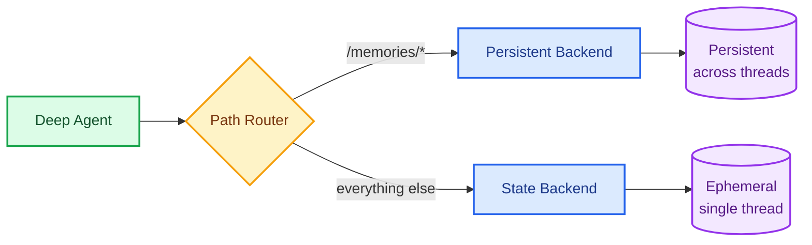

Memory lets your agent learn and improve across conversations. Deep Agents makes memory first class with a filesystem-based system: the agent reads and writes memory as files, and you control where those files are stored using [backends](/oss/javascript/deepagents/backends).

How you structure memory depends on the type of agent you're building. Two common patterns:

- **Autonomous agents** act as their own identity. They maintain an `AGENTS.md` file (and optionally other files like skills) that the agent itself updates over time. Memory is shared across all user conversations. Think of a coding agent that learns project conventions, or a support agent that refines its own response style.
- **Assistants** act on behalf of individual users. They have fixed core instructions (not editable by the agent) and per-user memory files like `preferences.md` that store each user's context. Memory is scoped per user so each person gets a personalized experience.

These aren't mutually exclusive. Many production agents combine both: agent-scoped memory for shared knowledge and user-scoped memory for personalization.

<Note>
This page covers **long-term memory**: memory that persists across conversations. For short-term memory (conversation history and scratch files within a single session), see the [context engineering](/oss/javascript/deepagents/context-engineering) guide. Short-term memory is managed automatically as part of the agent's [state](/oss/javascript/langgraph/graph-api#state).
</Note>

## Quick start

1. **You configure memory paths.** Pass file paths to `memory=` when creating the agent (e.g., `memory=["/memories/AGENTS.md"]`).
2. **Memory is loaded into the prompt.** At the start of each conversation, the built-in `MemoryMiddleware` reads those files and injects them into the system prompt inside `<agent_memory>` tags, along with guidelines for when and how to update memory.
3. **The agent writes to update.** During the conversation, the agent uses its built-in `edit_file` tool to update memory files. Changes are persisted by the [backend](/oss/javascript/deepagents/backends).


```typescript
import { createDeepAgent } from "deepagents";

const agent = createDeepAgent({
  memory: ["/memories/AGENTS.md"],
});
```


A preference saved in one conversation is available in the next:


```typescript
import { v4 as uuidv4 } from "uuid";

// Thread 1: Agent learns a preference and saves it to /memories/AGENTS.md
const config1 = { configurable: { thread_id: uuidv4() } };
await agent.invoke({
  messages: [{ role: "user", content: "I prefer concise responses. Remember that." }],
}, config1);

// Thread 2: Agent reads /memories/AGENTS.md and applies the preference
const config2 = { configurable: { thread_id: uuidv4() } };
await agent.invoke({
  messages: [{ role: "user", content: "Explain how transformers work." }],
}, config2);
```


## How memories are scoped

To persist memory across conversations, route `/memories/` to a persistent backend using a [`CompositeBackend`](https://reference.langchain.com/javascript/deepagents/backends/CompositeBackend). How you scope the backend controls who can see the memory: [agent-scoped](#agent-scoped-memory) (shared across all users) or [user-scoped](#user-scoped-memory) (isolated per user).



## Agent-scoped memory

Agent-scoped memory is shared across all users and is the natural fit for **autonomous agents**. The agent has a single `AGENTS.md` file that it reads at the start of every conversation and updates when it learns something new. If you've used `CLAUDE.md` or `.cursorrules`, this is the same idea.

In this pattern:
- `AGENTS.md` and [skills](/oss/javascript/deepagents/skills) live in the filesystem and are editable by the agent
- [Episodic memory](#episodic-memory) spans all user conversations since the agent is the primary identity
- The agent improves its own behavior over time without developer intervention


```typescript
import { createDeepAgent, CompositeBackend, StateBackend, StoreBackend } from "deepagents";
import { getConfig } from "@langchain/langgraph";

const agent = createDeepAgent({
  memory: ["/memories/AGENTS.md"],
  backend: new CompositeBackend(
    new StateBackend(),
    {
      "/memories/": new StoreBackend({
        namespace: (ctx) => {
          const config = getConfig();
          return [config.metadata.assistantId];
        },
      }),
    },
  ),
});
```


### AGENTS.md examples

Over time, the file accumulates context and the agent improves without any external orchestration:

**Customer support agent:**
```markdown
## Response style
- Keep responses under 3 sentences unless the user asks for detail
- Always include a link to the relevant help center article
- Sign off with "Let me know if you need anything else!"

## Known issues
- Billing portal returns 500 errors for accounts created before 2024-01
  → escalate to #billing-eng, do not troubleshoot
- Password reset emails delayed up to 15 min during peak hours (10am-2pm ET)
```

**Coding agent:**
```markdown
## Project conventions
- Use ruff for formatting, not black
- Tests go in tests/ mirroring src/ structure
- Always run `make lint` before suggesting a PR

## Learned patterns
- The auth middleware expects a Bearer token, not Basic
- Database migrations must be backward-compatible (online deploys)

## User preferences
- Prefers single bundled PRs over many small ones for refactors
- Wants type annotations on all public functions
```

This pattern works because it's simple (one file, no schema), transparent (readable text), and compounds (every conversation can make the agent better).

## User-scoped memory

User-scoped memory is isolated per user and is the natural fit for **assistants**. Each user gets their own memory file for preferences and context.

In this pattern:
- Core agent instructions are fixed and not stored in the filesystem (they come from the system prompt or deployment config)
- [Skills](/oss/javascript/deepagents/skills) are not editable by the agent
- Per-user files like `preferences.md` are in the filesystem and editable
- [Episodic memory](#episodic-memory) is scoped to that user's conversations only


```typescript
import { createDeepAgent, CompositeBackend, StateBackend, StoreBackend } from "deepagents";

const agent = createDeepAgent({
  memory: ["/memories/preferences.md"],
  backend: new CompositeBackend(
    new StateBackend(),
    {
      "/memories/": new StoreBackend({
        namespace: (ctx) => [ctx.runtime.context.userId],
      }),
    },
  ),
});
```


## Store implementations

`StoreBackend` works with any LangGraph [`BaseStore`](https://reference.langchain.com/javascript/langchain-core/stores/BaseStore) implementation. The store is LangGraph's cross-thread persistence layer: it lets you save and retrieve data scoped to any custom namespace, not just a single thread. When deploying to [LangSmith Deployment](/langsmith/deployment), the platform provisions a store automatically.

For local development, [`InMemoryStore`](https://reference.langchain.com/javascript/langchain-core/stores/InMemoryStore) is sufficient. It stores data in an in-memory dictionary and supports basic operations (`put`, `search`, `get`) as well as [semantic search](/oss/javascript/langgraph/persistence#semantic-search) with embeddings.

For production, use a persistent store:

| Store | Use case |
|---|---|
| [`PostgresStore`](https://reference.langchain.com/javascript/langchain-langgraph-checkpoint-postgres/store/PostgresStore) | Recommended for most production deployments. Supports async via `AsyncPostgresStore`. |
| @[`RedisStore`] | Low-latency access patterns. Supports async via `AsyncRedisStore`. |
| Custom | Implement the [`BaseStore`](https://reference.langchain.com/javascript/langchain-core/stores/BaseStore) interface to back memory with a vector database, custom API, or cloud storage. See the [backend protocol](/oss/javascript/deepagents/backends#protocol-reference). |


```typescript
import { PostgresStore } from "@langchain/langgraph-checkpoint-postgres";

const store = new PostgresStore({
  connectionString: process.env.DATABASE_URL,
});
```


Each memory is stored as an `Item` with a `value` (the data), `key` (unique identifier), `namespace` (scoping tuple), and timestamps (`created_at`, `updated_at`). You interact with the store using `store.put(namespace, key, value)` to write, `store.search(namespace)` to list, and `store.get(namespace, key)` to retrieve a specific item.

For more on store operations, semantic search, and using stores inside LangGraph nodes, see the [persistence guide](/oss/javascript/langgraph/persistence#memory-store).

<Accordion title="FileData schema">

Files stored via `StoreBackend` use the following schema:

```python
{
    "content": ["line 1", "line 2", "line 3"],  # List of strings (one per line)
    "created_at": "2024-01-15T10:30:00Z",       # ISO 8601 timestamp
    "modified_at": "2024-01-15T11:45:00Z"       # ISO 8601 timestamp
}
```

You can use the `create_file_data` helper to create properly formatted file data:


```typescript
import { createFileData } from "deepagents";

const fileData = createFileData("Hello\nWorld");
// { content: ['Hello', 'World'], created_at: '...', modified_at: '...' }
```


For more details on backend protocols, see [Backends](/oss/javascript/deepagents/backends#protocol-reference).

</Accordion>

## Advanced usage

The sections above cover the basics: configure memory paths, choose a scope, and let the agent handle the rest. This section covers more advanced patterns.

| Dimension | Question it answers | Options |
|---|---|---|
| **Duration** | How long does it last? | [Short-term](/oss/javascript/deepagents/context-engineering) (single conversation) or [long-term](#how-it-works) (across conversations) |
| **Information type** | What kind of information is it? | [Episodic](/oss/javascript/concepts/memory#episodic-memory) (experiences), [procedural](/oss/javascript/concepts/memory#procedural-memory) (instructions and [skills](/oss/javascript/deepagents/skills)), or [semantic](/oss/javascript/concepts/memory#semantic-memory) (facts) |
| **Scope** | Who can see and modify it? | [User](#user-scoped-memory), [agent](#agent-scoped-memory), or [organization](#organization-level-memory) |
| **Update strategy** | When are memories written? | During conversation (default) or [between conversations](#background-consolidation) |
| **Retrieval** | How are memories read? | Loaded into prompt (default), on demand (e.g., [episodic memory](#episodic-memory), [skills](/oss/javascript/deepagents/skills)), or via [custom middleware](#custom-memory-loading) |
| **Agent permissions** | Can the agent write to memory? | [Read-write](#read-only-vs-writable-memory) (default) or [read-only](#read-only-vs-writable-memory) (for shared policies) |

### Episodic memory

Episodic memory lets the agent reference past conversations to learn from what worked and what didn't. Deep Agents get this for free through [checkpointers](/oss/javascript/langgraph/persistence#checkpoints): every conversation is persisted as a checkpointed thread.

Wrap thread search in a tool so the agent can look up past experiences on demand:


```typescript
import { Client } from "@langchain/langgraph-sdk";
import { tool } from "@langchain/core/tools";

const client = new Client({ apiUrl: "<DEPLOYMENT_URL>" });

const searchPastConversations = tool(
  async ({ query, userId }: { query: string; userId: string }) => {
    const threads = await client.threads.search({
      metadata: { userId },
      limit: 5,
    });
    const results = [];
    for (const thread of threads) {
      const history = await client.threads.getHistory(thread.threadId);
      results.push(history);
    }
    return JSON.stringify(results);
  },
  {
    name: "search_past_conversations",
    description: "Search past conversations for relevant context.",
  }
);
```


This is useful for agents that perform complex, multi-step tasks. For example, a coding agent can look back at a past debugging session and skip straight to the likely root cause.

### Organization-level memory

For policies or knowledge that should apply across all users and agents, scope memory by `org_id`. This is typically **read-only** to prevent prompt injection via shared state. See [read-only vs writable memory](#read-only-vs-writable-memory) for details.

Populate organization memory from your application code:


```typescript
import { Client } from "@langchain/langgraph-sdk";

const client = new Client({ apiUrl: "<DEPLOYMENT_URL>" });

await client.store.putItem(
  [orgId, "policies"],
  "/compliance.txt",
  {
    content: [
      "Never disclose internal pricing",
      "Always include disclaimers on financial advice",
    ],
    created_at: "2026-03-01T00:00:00Z",
    modified_at: "2026-03-01T00:00:00Z",
  }
);
```


Load organization memory into the prompt alongside user memory by adding it to the `memory` list. Use [policy hooks](/oss/javascript/deepagents/backends#add-policy-hooks) to enforce that org-level memory is read-only.

### Background consolidation

By default, the agent writes memories during the conversation (hot path). An alternative is to process memories **between conversations** as a background task, sometimes called **sleep time compute**. After a conversation ends, a separate process reviews the transcript, extracts key facts, and merges them with existing memories.

| Approach | Pros | Cons |
|---|---|---|
| **Hot path** (during conversation) | Memories available immediately, transparent to user | Adds latency, agent must multitask |
| **Background** (between conversations) | No user-facing latency, better consolidation quality | Memories not available until next conversation, requires additional infrastructure |

For most applications, the hot path is sufficient. Add background consolidation when you need to reduce latency or improve memory quality across many conversations.


Use a webhook, cron job, or background task runner to trigger consolidation after each conversation:


```typescript
import { Client } from "@langchain/langgraph-sdk";
import { ChatAnthropic } from "@langchain/anthropic";

const client = new Client({ apiUrl: "<DEPLOYMENT_URL>" });

async function consolidateMemories(userId: string, threadId: string) {
  // 1. Get the conversation history
  const history = await client.threads.getHistory(threadId);
  const messages = history.values.messages;

  // 2. Read existing memories
  const namespace = [userId];
  const existing = await client.store.getItem(namespace, "/preferences.md");
  const existingContent = existing?.value?.content?.join("\n") ?? "";

  // 3. Use an LLM to extract and merge new facts
  const llm = new ChatAnthropic({ model: "claude-sonnet-4-6" });
  const result = await llm.invoke(
    `Review this conversation and update the user's memory file.

    Current memories:
    ${existingContent}

    Conversation:
    ${JSON.stringify(messages)}

    Return the updated memory file contents. Merge new facts,
    remove outdated information, and keep it concise.`
  );

  // 4. Write consolidated memories back to the store
  await client.store.putItem(namespace, "/preferences.md", {
    content: (result.content as string).split("\n"),
  });
}
```


This avoids adding latency to the conversation and produces better-quality memories since consolidation can consider the full conversation at once. The tradeoff is that new memories aren't available until the next conversation.

### Read-only vs writable memory

By default, the agent can both read and write memory files. For shared state like organization policies or compliance rules, you may want to make memory **read-only** so the agent can reference it but not modify it. This prevents prompt injection via shared memory and ensures that only your application code controls what's in the file.

| Permission | Use case | How it works |
|---|---|---|
| **Read-write** (default) | User preferences, agent self-improvement, learned patterns | Agent updates files via `edit_file` tool |
| **Read-only** | Organization policies, compliance rules, shared knowledge bases | Populate via application code or the [Store API](/langsmith/custom-store). Use [policy hooks](/oss/javascript/deepagents/backends#add-policy-hooks) to block agent writes. |

To enforce read-only memory, use [policy hooks](/oss/javascript/deepagents/backends#add-policy-hooks) on the backend that reject write operations to specific paths:


```typescript
import { createDeepAgent, CompositeBackend, StateBackend, StoreBackend } from "deepagents";

const agent = createDeepAgent({
  memory: [
    "/memories/preferences.md",   // Read-write: agent can update
    "/policies/compliance.md",    // Read-only: agent can only read
  ],
  backend: new CompositeBackend(
    new StateBackend(),
    {
      "/memories/": new StoreBackend({
        namespace: (ctx) => [ctx.runtime.context.userId],
      }),
      "/policies/": new StoreBackend({
        namespace: (ctx) => [ctx.runtime.context.orgId, "policies"],
        readOnly: true,
      }),
    },
  ),
});
```


### Custom memory loading

By default, `MemoryMiddleware` loads memory files into the system prompt at the start of each conversation. For more control over how memories are injected, use [custom middleware](/oss/javascript/langchain/middleware/custom) to load memories yourself.

This is useful when you want to load memories from a different source, apply custom formatting, or combine memory with other context before injecting it into the prompt.


```typescript
import { createDeepAgent, CompositeBackend, StateBackend, StoreBackend } from "deepagents";
import { wrapModelCall } from "@langchain/core/middleware";

const loadMemories = wrapModelCall(async (request, handler) => {
  const { runtime } = request;
  const store = runtime.store;
  const namespace = [runtime.context.userId];

  const item = await store.get(namespace, "/preferences.md");
  if (item?.value) {
    const memories = item.value.content.join("\n");
    const newContent = [
      ...request.systemMessage.contentBlocks,
      {
        type: "text",
        text: `Memory file: /memories/preferences.md\n<user_memories>\n${memories}\n</user_memories>`,
      },
    ];
    return handler(request.override({
      systemMessage: { content: newContent },
    }));
  }

  return handler(request);
});

const agent = createDeepAgent({
  backend: new CompositeBackend(
    new StateBackend(),
    {
      "/memories/": new StoreBackend({
        namespace: (ctx) => [ctx.runtime.context.userId],
      }),
    },
  ),
  middleware: [loadMemories],
});
```


### Environment seeding

When an agent runs inside a [sandbox](/oss/javascript/deepagents/sandboxes), it operates in an isolated container that can't directly access the memory store. To bridge this gap, seed memories into the sandbox before the agent runs and sync updated memories back after it finishes. Use [custom middleware](/oss/javascript/langchain/middleware/custom) with `before_agent` and `after_agent` hooks.

For implementation details and a full code example, see the [file transfers](/oss/javascript/deepagents/going-to-production#file-transfers) guide.

### Skills as memory

[Skills](/oss/javascript/deepagents/skills) are reusable agent capabilities defined as `SKILL.md` files. They function as a form of long-term memory: persistent instructions that shape agent behavior across conversations. The agent can also create and refine its own skills at a writable path like `/memories/skills/`.

For details on configuring skills, see the [skills guide](/oss/javascript/deepagents/skills).

## FAQ

<Accordion title="Can multiple threads write to memory in parallel?">
Yes, but concurrent writes to the **same file** can cause last-write-wins conflicts. For user-scoped memory this is rare since users typically have one active conversation at a time. For agent-scoped or organization-scoped memory, consider using [background consolidation](#background-consolidation) to serialize writes, or structure memory as separate files per topic to reduce contention.
</Accordion>

<Accordion title="How do I isolate memory across multiple agents in the same deployment?">
If you deploy multiple agents in the same LangGraph deployment and need each agent to have its own memory, add the agent's `assistant_id` to the namespace. This prevents agents from reading or overwriting each other's memory files.


```typescript
import { createDeepAgent, CompositeBackend, StateBackend, StoreBackend } from "deepagents";
import { getConfig } from "@langchain/langgraph";

const agent = createDeepAgent({
  memory: ["/memories/preferences.md"],
  backend: new CompositeBackend(
    new StateBackend(),
    {
      "/memories/": new StoreBackend({
        namespace: (ctx) => {
          const config = getConfig();
          return [config.metadata.assistantId, ctx.runtime.context.userId];
        },
      }),
    },
  ),
});
```


The namespace `(assistant_id, user_id)` scopes memory to both the specific agent and the specific user. If you only need per-agent isolation without per-user scoping, use `(assistant_id,)` alone.
</Accordion>

<Accordion title="How do I audit what the agent stores?">
Use [LangSmith tracing](/langsmith/tracing) to monitor what your agent writes to memory. Every file write appears as a tool call in the trace, so you can review exactly what was stored and when.
</Accordion>

<Accordion title="How do I prevent prompt injection via shared memory?">
If one user can write to memory that another user reads, a malicious user could inject instructions into shared state. To mitigate this:

- **Default to user scope** `(user_id)` unless you have a specific reason to share
- Use **[read-only memory](#read-only-vs-writable-memory)** for shared policies (populate via application code, not the agent)
- Use [policy hooks](/oss/javascript/deepagents/backends#add-policy-hooks) to block unauthorized writes
- On [LangSmith](/langsmith/home), use [RBAC](/langsmith/rbac) and [ABAC](/langsmith/abac) to restrict access
</Accordion>

---

<div className="source-links">
<Callout icon="edit">
    [Edit this page on GitHub](https://github.com/langchain-ai/docs/edit/main/src/oss/deepagents/memory.mdx) or [file an issue](https://github.com/langchain-ai/docs/issues/new/choose).
</Callout>
<Callout icon="terminal-2">
    [Connect these docs](/use-these-docs) to Claude, VSCode, and more via MCP for real-time answers.
</Callout>
</div>
