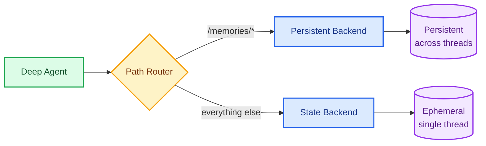
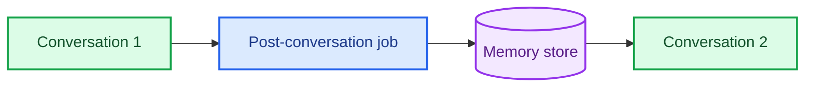

Long-term memory lets your agent learn and improve across conversations. Deep Agents makes long-term memory first class with a filesystem-based memory system: the agent reads and writes memory as files, and you control where those files are stored using [backends](/oss/python/deepagents/backends).

<Note>
This page covers **long-term memory**: memory that persists across conversations. For short-term memory (conversation history and scratch files within a single session), see the [context engineering](/oss/python/deepagents/context-engineering) guide. Short-term memory is managed automatically as part of the agent's [state](/oss/python/langgraph/graph-api#state).
</Note>

## Quick start

1. **You configure memory paths.** Pass file paths to `memory=` when creating the agent (e.g., `memory=["/memories/AGENTS.md"]`).
2. **Memory is loaded into the prompt.** At the start of each conversation, the built-in `MemoryMiddleware` reads those files and injects them into the system prompt inside `<agent_memory>` tags, along with guidelines for when and how to update memory.
3. **The agent writes to update.** During the conversation, the agent uses its built-in `edit_file` tool to update memory files. Changes are persisted by the [backend](/oss/python/deepagents/backends).

```python
from deepagents import create_deep_agent

agent = create_deep_agent(
    memory=["/memories/AGENTS.md"],
)
```


A preference saved in one conversation is available in the next:

```python
import uuid

# Thread 1: Agent learns a preference and saves it to /memories/AGENTS.md
config1 = {"configurable": {"thread_id": str(uuid.uuid4())}}
agent.invoke({
    "messages": [{"role": "user", "content": "I prefer concise responses. Remember that."}]
}, config=config1)

# Thread 2: Agent reads /memories/AGENTS.md and applies the preference
config2 = {"configurable": {"thread_id": str(uuid.uuid4())}}
agent.invoke({
    "messages": [{"role": "user", "content": "Explain how transformers work."}]
}, config=config2)
```


## How memories are scoped

To persist memory across conversations, route `/memories/` to a [`StoreBackend`](https://reference.langchain.com/python/deepagents/backends/store/StoreBackend) using a [`CompositeBackend`](https://reference.langchain.com/python/deepagents/backends/composite/CompositeBackend). The `namespace` on `StoreBackend` controls who can see the memory: [agent-scoped](#agent-scoped-memory) (shared across all users) or [user-scoped](#user-scoped-memory) (isolated per user).



## Agent-scoped memory

Agent-scoped memory is shared across all users. The agent has a single `AGENTS.md` file that it reads at the start of every conversation and updates when it learns something new. If you've used `CLAUDE.md` or `.cursorrules`, this is the same idea.

```python
from deepagents import create_deep_agent
from deepagents.backends import CompositeBackend, StateBackend, StoreBackend
from langgraph.config import get_config

agent = create_deep_agent(
    memory=["/memories/AGENTS.md"],
    backend=CompositeBackend(
        default=StateBackend(),
        routes={
            "/memories/": StoreBackend(
                namespace=lambda ctx: (
                    get_config()["metadata"]["assistant_id"],
                ),
            ),
        },
    ),
)
```


### AGENTS.md examples

Over time, the file accumulates context and the agent improves without any external orchestration:

**Customer support agent:**
```markdown
## Response style
- Keep responses under 3 sentences unless the user asks for detail
- Always include a link to the relevant help center article
- Sign off with "Let me know if you need anything else!"

## Known issues
- Billing portal returns 500 errors for accounts created before 2024-01
  → escalate to #billing-eng, do not troubleshoot
- Password reset emails delayed up to 15 min during peak hours (10am-2pm ET)
```

**Coding agent:**
```markdown
## Project conventions
- Use ruff for formatting, not black
- Tests go in tests/ mirroring src/ structure
- Always run `make lint` before suggesting a PR

## Learned patterns
- The auth middleware expects a Bearer token, not Basic
- Database migrations must be backward-compatible (online deploys)

## User preferences
- Prefers single bundled PRs over many small ones for refactors
- Wants type annotations on all public functions
```

This pattern works because it's simple (one file, no schema), transparent (readable text), and compounds (every conversation can make the agent better).

## User-scoped memory

User-scoped memory is isolated per user. Each user gets their own memory file for preferences and context. Scope by `user_id` in the namespace:

```python
from deepagents import create_deep_agent
from deepagents.backends import CompositeBackend, StateBackend, StoreBackend

agent = create_deep_agent(
    memory=["/memories/preferences.md"],
    backend=CompositeBackend(
        default=StateBackend(),
        routes={
            "/memories/": StoreBackend(
                namespace=lambda ctx: (ctx.runtime.context.user_id,),
            ),
        },
    ),
)
```


## Store implementations

`StoreBackend` works with any LangGraph `BaseStore` implementation. When deploying to [LangSmith Deployment](/langsmith/deployment), the platform provisions a store automatically. You can also persist memories to a vector database, a custom API, or cloud storage by implementing the [backend protocol](/oss/python/deepagents/backends#protocol-reference).

For local development, `InMemoryStore` is sufficient. For production, use a persistent store:

```python
from langgraph.store.postgres import PostgresStore
import os

store_ctx = PostgresStore.from_conn_string(os.environ["DATABASE_URL"])
store = store_ctx.__enter__()
store.setup()
```


<Accordion title="FileData schema">

Files stored via `StoreBackend` use the following schema:

```python
{
    "content": ["line 1", "line 2", "line 3"],  # List of strings (one per line)
    "created_at": "2024-01-15T10:30:00Z",       # ISO 8601 timestamp
    "modified_at": "2024-01-15T11:45:00Z"       # ISO 8601 timestamp
}
```

You can use the `create_file_data` helper to create properly formatted file data:

```python
from deepagents.backends.utils import create_file_data

file_data = create_file_data("Hello\nWorld")
# {'content': ['Hello', 'World'], 'created_at': '...', 'modified_at': '...'}
```


For more details on backend protocols, see [Backends](/oss/python/deepagents/backends#protocol-reference).

</Accordion>

## Advanced usage

The sections above cover the basics: configure memory paths, choose a scope, and let the agent handle the rest. This section covers more advanced patterns.

| Dimension | Question it answers | Options |
|---|---|---|
| **Duration** | How long does it last? | [Short-term](/oss/python/deepagents/context-engineering) (single conversation) or [long-term](#how-it-works) (across conversations) |
| **Information type** | What kind of information is it? | [Episodic](/oss/python/concepts/memory#episodic-memory) (experiences), [procedural](/oss/python/concepts/memory#procedural-memory) (instructions and [skills](/oss/python/deepagents/skills)), or [semantic](/oss/python/concepts/memory#semantic-memory) (facts) |
| **Scope** | Who can see and modify it? | [User](#user-scoped-memory), [agent](#agent-scoped-memory), or [organization](#organization-level-memory) |
| **Update strategy** | When are memories written? | During conversation (default) or [between conversations](#background-consolidation) |
| **Retrieval** | How are memories read? | Loaded into prompt (default) or on demand (e.g., [episodic memory](#episodic-memory), [skills](/oss/python/deepagents/skills)) |

### Episodic memory

Episodic memory lets the agent reference past conversations to learn from what worked and what didn't. Deep Agents get this for free through [checkpointers](/oss/python/langgraph/persistence#checkpoints): every conversation is persisted as a checkpointed thread.

Wrap thread search in a tool so the agent can look up past experiences on demand:

```python
from langgraph_sdk import get_client
from langchain_core.tools import tool

client = get_client(url="<DEPLOYMENT_URL>")


@tool
async def search_past_conversations(query: str, user_id: str) -> str:
    """Search past conversations for relevant context."""
    threads = await client.threads.search(
        metadata={"user_id": user_id},
        limit=5,
    )
    results = []
    for thread in threads:
        history = await client.threads.get_history(thread_id=thread["thread_id"])
        results.append(history)
    return str(results)
```


This is useful for agents that perform complex, multi-step tasks. For example, a coding agent can look back at a past debugging session and skip straight to the likely root cause.

### Organization-level memory

For policies or knowledge that should apply across all users and agents, scope memory by `org_id`. This is typically **read-only** to prevent prompt injection via shared state.

Populate organization memory from your application code:

```python
from langgraph_sdk import get_client

client = get_client(url="<DEPLOYMENT_URL>")

await client.store.put_item(
    (org_id, "policies"),
    "/compliance.txt",
    {
        "content": [
            "Never disclose internal pricing",
            "Always include disclaimers on financial advice",
        ],
        "created_at": "2026-03-01T00:00:00Z",
        "modified_at": "2026-03-01T00:00:00Z",
    },
)
```


Load organization memory into the prompt alongside user memory by adding it to the `memory` list. Use [policy hooks](/oss/python/deepagents/backends#add-policy-hooks) to enforce that org-level memory is read-only.

### Background consolidation

By default, the agent writes memories during the conversation (hot path). An alternative is to process memories **between conversations** as a background task. After a conversation ends, a separate process reviews the transcript, extracts key facts, and merges them with existing memories.

| Approach | Pros | Cons |
|---|---|---|
| **Hot path** (during conversation) | Memories available immediately, transparent to user | Adds latency, agent must multitask |
| **Background** (between conversations) | No user-facing latency, better consolidation quality | Memories not available until next conversation, requires additional infrastructure |

For most applications, the hot path is sufficient. Add background consolidation when you need to reduce latency or improve memory quality across many conversations.



Use a webhook or background task to run consolidation after each conversation:

```python
from langgraph_sdk import get_client

client = get_client(url="<DEPLOYMENT_URL>")


async def consolidate_memories(user_id: str, thread_id: str):
    """Run after a conversation ends to consolidate memories."""
    # 1. Get the conversation history
    history = await client.threads.get_history(thread_id)
    messages = history["values"]["messages"]

    # 2. Read existing memories
    namespace = (user_id,)
    existing = await client.store.get_item(namespace, "/preferences.md")
    existing_content = ""
    if existing:
        existing_content = "\n".join(existing.value.get("content", []))

    # 3. Use an LLM to extract and merge new facts
    from langchain.chat_models import init_chat_model

    llm = init_chat_model("claude-sonnet-4-6")
    result = await llm.ainvoke(
        f"""Review this conversation and update the user's memory file.

        Current memories:
        {existing_content}

        Conversation:
        {messages}

        Return the updated memory file contents. Merge new facts,
        remove outdated information, and keep it concise."""
    )

    # 4. Write consolidated memories back to the store
    await client.store.put_item(
        namespace,
        "/preferences.md",
        {
            "content": result.content.split("\n"),
        },
    )
```


This avoids adding latency to the conversation and produces better-quality memories since consolidation can consider the full conversation at once. The tradeoff is that new memories aren't available until the next conversation.

### Multiple agents in the same deployment

If you deploy multiple agents and need to isolate memory per agent, add the agent ID to the namespace. This prevents agents from reading or overwriting each other's memory.

```python
from deepagents import create_deep_agent
from deepagents.backends import CompositeBackend, StateBackend, StoreBackend
from langgraph.config import get_config

agent = create_deep_agent(
    memory=["/memories/preferences.md"],
    backend=CompositeBackend(
        default=StateBackend(),
        routes={
            "/memories/": StoreBackend(
                namespace=lambda ctx: (
                    get_config()["metadata"]["assistant_id"],
                    ctx.runtime.context.user_id,
                ),
            ),
        },
    ),
)
```


### Environment seeding

When an agent runs inside a [sandbox](/oss/python/deepagents/sandboxes), it operates in an isolated container that can't directly access the memory store. To bridge this gap, seed memories into the sandbox before the agent runs and sync updated memories back after it finishes. Use [custom middleware](/oss/python/langchain/middleware/custom) with `before_agent` and `after_agent` hooks.

For implementation details and a full code example, see the [file transfers](/oss/python/deepagents/going-to-production#file-transfers) guide.

### Skills as memory

[Skills](/oss/python/deepagents/skills) are reusable agent capabilities defined as `SKILL.md` files. They function as a form of long-term memory: persistent instructions that shape agent behavior across conversations. The agent can also create and refine its own skills at a writable path like `/memories/skills/`.

For details on configuring skills, see the [skills guide](/oss/python/deepagents/skills).

## FAQ

<Accordion title="Can multiple threads write to memory in parallel?">
Yes, but concurrent writes to the **same file** can cause last-write-wins conflicts. For user-scoped memory this is rare since users typically have one active conversation at a time. For agent-scoped or organization-scoped memory, consider using [background consolidation](#background-consolidation) to serialize writes, or structure memory as separate files per topic to reduce contention.
</Accordion>

<Accordion title="How do I audit what the agent stores?">
Use [LangSmith tracing](/langsmith/tracing) to monitor what your agent writes to memory. Every file write appears as a tool call in the trace, so you can review exactly what was stored and when.
</Accordion>

<Accordion title="How do I prevent prompt injection via shared memory?">
If one user can write to memory that another user reads, a malicious user could inject instructions into shared state. To mitigate this:

- **Default to user scope** `(user_id)` unless you have a specific reason to share
- Use **read-only memory** for shared policies (populate via application code, not the agent)
- Use [policy hooks](/oss/python/deepagents/backends#add-policy-hooks) to block unauthorized writes
- On [LangSmith](/langsmith/home), use [RBAC](/langsmith/rbac) and [ABAC](/langsmith/abac) to restrict access
</Accordion>

---

<div className="source-links">
<Callout icon="edit">
    [Edit this page on GitHub](https://github.com/langchain-ai/docs/edit/main/src/oss/deepagents/long-term-memory.mdx) or [file an issue](https://github.com/langchain-ai/docs/issues/new/choose).
</Callout>
<Callout icon="terminal-2">
    [Connect these docs](/use-these-docs) to Claude, VSCode, and more via MCP for real-time answers.
</Callout>
</div>
