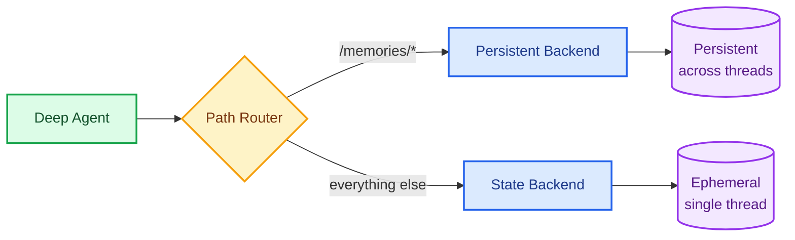

Memory is what separates an agent that starts from scratch every conversation from one that genuinely improves over time. It lets agents learn from feedback, remember user preferences, and build on previous work. Deep Agents make long-term memory a first-class primitive, so your agent can start accumulating knowledge from the very first conversation and apply it in every future one.

## Dimensions of memory

Memory varies along three dimensions:

| Dimension | Options | Question it answers |
|---|---|---|
| **Duration** | [Short-term](/oss/python/deepagents/context-engineering) (single conversation) or [long-term](#setup) (across conversations) | How long does it last? |
| [**Information type**](#information-type) | [Semantic](/oss/python/concepts/memory#semantic-memory) (facts), [episodic](/oss/python/concepts/memory#episodic-memory) (experiences), or [procedural](/oss/python/concepts/memory#procedural-memory) (instructions) | What kind of information is it? |
| [**Scope**](#namespace-scoping) | [User, assistant, or org scoped](#namespace-scoping) | Who can see and modify it? |

This page focuses on **long-term memory**: memory that persists across conversations. For short-term memory (conversation history and scratch files within a single session), see the [context engineering](/oss/python/deepagents/context-engineering) guide. Short-term memory is managed automatically as part of the agent's [state](/oss/python/langgraph/graph-api#state).

### Information type

Different types of information call for different memory patterns. These categories (from [cognitive science](https://en.wikipedia.org/wiki/Memory#Types)) map directly to how agents use memory:

| Type | What is stored | Agent pattern |
|---|---|---|
| [Semantic](/oss/python/concepts/memory#semantic-memory) | Facts and knowledge | [Knowledge base](#knowledge-base) |
| [Episodic](/oss/python/concepts/memory#episodic-memory) | Past experiences | [Checkpointed conversations](#episodic-memory) |
| [Procedural](/oss/python/concepts/memory#procedural-memory) | Instructions and rules | [agents.md](#the-agentsmd-pattern), [user preferences](#user-preferences), [persistent skills](#persistent-skills) |

For a deeper conceptual overview of memory types, see the [memory concepts guide](/oss/python/concepts/memory).

## Setup

The example below demonstrates how to set up long-term memory with a LangGraph [Store](/langsmith/custom-store) using **private scope** (scoped to a user for a given assistant). The same principles apply to any [scope](#namespace-scoping) or any persistent backend. Because backends are pluggable, you can persist memories to a vector database, a custom API, cloud storage, or anything else by implementing the [backend protocol](/oss/python/deepagents/backends#protocol-reference).

Use a [`CompositeBackend`](https://reference.langchain.com/python/deepagents/backends/composite/CompositeBackend) that routes `/memories/` to persistent storage:



```python
from deepagents import create_deep_agent
from deepagents.backends import CompositeBackend, StateBackend, StoreBackend
from langgraph.store.memory import InMemoryStore
from langgraph.checkpoint.memory import MemorySaver

checkpointer = MemorySaver()

def make_backend(runtime):
    return CompositeBackend(
        default=StateBackend(runtime),  # Short-term: ephemeral scratch space
        routes={
            "/memories/": StoreBackend(
                runtime,
                namespace=lambda ctx: (ctx.runtime.context.user_id,),
            )  # Long-term: persists across conversations
        }
    )

agent = create_deep_agent(
    store=InMemoryStore(),  # Good for local dev; omit for LangSmith Deployment
    backend=make_backend,
    checkpointer=checkpointer
)
```


<Accordion title="Store implementations">

`StoreBackend` works with any LangGraph `BaseStore` implementation. When deploying to [LangSmith Deployment](/langsmith/deployment), the platform provisions a store automatically.

For local development, `InMemoryStore` (shown above) is sufficient. For production, use a persistent store:

```python
from langgraph.store.postgres import PostgresStore
import os

store_ctx = PostgresStore.from_conn_string(os.environ["DATABASE_URL"])
store = store_ctx.__enter__()
store.setup()
```


</Accordion>

<Accordion title="FileData schema">

Files stored via `StoreBackend` use the following schema:

```python
{
    "content": ["line 1", "line 2", "line 3"],  # List of strings (one per line)
    "created_at": "2024-01-15T10:30:00Z",       # ISO 8601 timestamp
    "modified_at": "2024-01-15T11:45:00Z"       # ISO 8601 timestamp
}
```

You can use the `create_file_data` helper to create properly formatted file data:

```python
from deepagents.backends.utils import create_file_data

file_data = create_file_data("Hello\nWorld")
# {'content': ['Hello', 'World'], 'created_at': '...', 'modified_at': '...'}
```


For more details on backend protocols, see [Backends](/oss/python/deepagents/backends#protocol-reference).

</Accordion>

Once configured, files in `/memories/` can be accessed from any thread. A preference saved in one conversation is immediately available in the next:

```python
import uuid

# Thread 1: Agent saves preferences to /memories/agents.md
config1 = {"configurable": {"thread_id": str(uuid.uuid4())}}
agent.invoke({
    "messages": [{"role": "user", "content": "I prefer concise responses. Remember that."}]
}, config=config1)

# Thread 2: Agent reads /memories/agents.md and applies preferences
config2 = {"configurable": {"thread_id": str(uuid.uuid4())}}
agent.invoke({
    "messages": [{"role": "user", "content": "Explain how transformers work."}]
}, config=config2)
```


<Note>
`CompositeBackend` strips the route prefix before storing. `/memories/agents.md` is stored as `/agents.md` in the `StoreBackend`. The agent always uses the full path. See [CompositeBackend](/oss/python/deepagents/backends#compositebackend-router) for details.
</Note>

## Memory patterns

Each pattern below maps a use case to a memory type and a typical scope. All patterns assume you have configured a `CompositeBackend` with a `/memories/` route as shown in [Setup](#setup).

| Pattern | Memory type | Typical scope | Use case |
|---|---|---|---|
| [agents.md](#the-agentsmd-pattern) | Procedural | Assistant | Self-improving instructions shared across all users of an assistant |
| [User preferences](#user-preferences) | Procedural | Private | Per-user behavioral rules within a single assistant |
| [Knowledge base](#knowledge-base) | Semantic | Varies | Structured facts organized by topic |
| [Episodic memory](#episodic-memory) | Episodic | Private | Past experiences the agent can learn from |
| [Persistent skills](#persistent-skills) | Procedural | Often read-only | Reusable workflows the agent can invoke |

### The agents.md pattern

The most common memory pattern is a single instructions file that the agent reads at the start of every conversation and updates when it learns something new. If you've used `CLAUDE.md`, `.cursorrules`, or similar project files, this is the same idea: a persistent document that shapes how the agent behaves, maintained by the agent itself.

This is typically scoped at the **assistant** level so that improvements benefit all users of that assistant.

```
/memories/agents.md    # Accumulated instructions, rules, and context
```

```
You have persistent memory at /memories/.

Read /memories/agents.md at the start of each conversation. This file
contains your accumulated instructions and important context.

When users provide feedback ("always do X", "I prefer Y", "remember that Z"),
update /memories/agents.md using the edit_file tool. Keep it organized
and pruned — remove outdated entries, consolidate related items.
```

Over time, the file accumulates context and the agent improves without any external orchestration. This pattern works well because:

- **It's simple.** One file, one place to look. No schema, no database queries.
- **It's transparent.** Users can ask the agent to show its memory, and the result is readable text.
- **It compounds.** Every conversation can make the agent better. Feedback, corrections, and preferences accumulate automatically.

After a few conversations, an agent's `agents.md` file might look like this:

**Customer support agent:**
```markdown
## Response style
- Keep responses under 3 sentences unless the user asks for detail
- Always include a link to the relevant help center article
- Sign off with "Let me know if you need anything else!"

## Known issues
- Billing portal returns 500 errors for accounts created before 2024-01
  → escalate to #billing-eng, do not troubleshoot
- Password reset emails delayed up to 15 min during peak hours (10am-2pm ET)

## User context
- Enterprise customers should be directed to their dedicated CSM
- Free tier users cannot access the API — suggest upgrade path
```

**Coding agent:**
```markdown
## Project conventions
- Use ruff for formatting, not black
- Tests go in tests/ mirroring src/ structure
- Always run `make lint` before suggesting a PR

## Learned patterns
- The auth middleware expects a Bearer token, not Basic
- Database migrations must be backward-compatible (online deploys)
- The CI build caches node_modules — delete cache if dependency issues

## User preferences
- Prefers single bundled PRs over many small ones for refactors
- Wants type annotations on all public functions
- Does not want trailing summaries at the end of responses
```

The file grows organically as the agent interacts with users. Over time, instruct the agent to consolidate related entries and prune outdated ones to keep it focused.

For most agents, start here. Add more structure only when a single file becomes unwieldy.

### User preferences

Store per-user behavioral rules like communication style, formatting choices, or response conventions. Preferences are procedural memory: they tell the agent _how to behave_, not just facts to recall. This is typically scoped **private** `(assistant_id, user_id)` so each user's preferences are isolated.

```
/memories/preferences.md    # User-specific settings and style
```

```
You have persistent memory at /memories/.

Read /memories/preferences.md at the start of each conversation for
the user's preferences (tone, formatting, language, signature, etc.).

When the user expresses a preference, save it to /memories/preferences.md.
```

### Knowledge base

When the agent needs to retain structured information across many topics, a single file becomes unwieldy. Use a directory structure instead. Knowledge bases can be scoped at any level depending on who should access the information: **private** for personal notes, **assistant** for shared team knowledge, or **user** for cross-assistant context.

```
/memories/projects/webapp/stack.txt       # Technology choices
/memories/projects/webapp/decisions.txt   # Architecture decisions
/memories/contacts/team.txt               # Team members and roles
```

```
You have persistent memory at /memories/.

When you learn facts about the user's projects, team, or domain,
save them to organized files under /memories/. Use subdirectories
to group related information.

At the start of each conversation, check /memories/ for relevant
context before asking the user to repeat themselves.
```

<Tip>
For simpler use cases, a single profile file may be enough. As the number of facts grows, a directory of individual documents offers higher recall at the cost of more complex updates. See the [profile vs collection](/oss/python/concepts/memory#semantic-memory) tradeoffs in the memory concepts guide.
</Tip>

### Episodic memory

Episodic memory records past experiences so the agent can learn from what worked and what didn't. Unlike semantic memory (facts) or procedural memory (instructions), episodic memory captures specific interactions the agent can reference as examples or use to avoid repeating mistakes.

Deep Agents get episodic memory for free through [checkpointers](/oss/python/langgraph/persistence#checkpoints). Every conversation is already persisted as a checkpointed thread, so the agent's full history of past interactions is available without any additional configuration. You can search and retrieve past threads using the [LangGraph SDK](https://langchain-ai.github.io/langgraph/cloud/reference/sdk/python_sdk_ref/#langgraph_sdk.client.LangGraphClient) to surface relevant past experiences.

This is typically scoped **private** since experiences are specific to a user's context.

```python
from langgraph_sdk import get_client

client = get_client(url="<DEPLOYMENT_URL>")

# List past threads for a user
threads = await client.threads.search(
    metadata={"user_id": user_id},
    limit=10,
)

# Read the full history of a specific thread
history = await client.threads.get_history(thread_id=threads[0]["thread_id"])
```


Episodic memory is particularly useful for agents that perform complex, multi-step tasks where the sequence of actions matters. For example, a coding agent can look back at a past debugging session and skip straight to the likely root cause instead of starting from scratch.

### Persistent skills

[Skills](/oss/python/deepagents/skills) are reusable agent capabilities defined as `SKILL.md` files. Skills are a form of procedural memory: they differ from other memory files in structure (frontmatter + steps) and mutability, but serve the same purpose of shaping agent behavior across conversations.

Skills are often **read-only**: seeded by your application code as curated playbooks or workflows that the agent can invoke but not modify. To make skills read-only, seed them from your application code and don't route the skill path to a writable backend. The agent can still create and refine its own skills at a separate writable path like `/memories/skills/`.

```
/memories/skills/data-viz/SKILL.md        # Learned visualization workflow
/memories/skills/data-viz/chart.py        # Supporting script
/memories/skills/code-review/SKILL.md     # Refined review checklist
```

```
You have persistent memory at /memories/.

You can create and update skills at /memories/skills/. Each skill
is a directory with a SKILL.md file describing when and how to use it.

When you discover a workflow that works well (e.g., a multi-step
data analysis process), save it as a skill so you can reuse it in
future conversations. Refine existing skills when you find improvements.
```

Point the agent at persistent skills by including `/memories/skills/` in the `skills` parameter:

```python
agent = create_deep_agent(
    skills=[
        "/skills/bundled/",      # Read-only: curated by your app
        "/memories/skills/",     # Read-write: learned by the agent
    ],
    backend=make_backend,
    store=store,
)
```


Because skills use [progressive disclosure](/oss/python/deepagents/skills#how-skills-work), only the frontmatter is read at startup. The full skill content is loaded only when the agent determines it's relevant, keeping token usage low even as the skill library grows.

## Read-only vs read-write memory

Not all memory should be writable by the agent. The filesystem model makes this distinction natural: route different paths to different backends with different permissions.

| Mode | Who writes | Use case | Example |
|---|---|---|---|
| **Read-only** | Developer or application code | Org policies, curated skills, compliance rules, reference data | "Never disclose internal pricing" |
| **Read-write** | The agent | Preferences, agents.md, episodic logs, learned skills | "User prefers concise responses" |

To implement this, use a `CompositeBackend` with separate routes. Paths the agent can update are routed to a `StoreBackend`. For read-only data, populate it via the [Store API](/langsmith/custom-store) from your application code and don't route it to a writable backend. You can also use [policy hooks](/oss/python/deepagents/backends#add-policy-hooks) to enforce fine-grained access control, such as blocking writes to specific paths or validating content before it is saved.

{/* TODO: Add ReadOnlyBackend support and update code example to show read-only route alongside read-write route */}

Populate read-only memory from your application code at deploy time or via a background job:

```python
from langgraph_sdk import get_client

client = get_client(url="<DEPLOYMENT_URL>")

await client.store.put_item(
    (org_id, "policies"),
    "/compliance.txt",
    {
        "content": ["Never disclose internal pricing", "Always include disclaimers on financial advice"],
        "created_at": "2026-03-01T00:00:00Z",
        "modified_at": "2026-03-01T00:00:00Z"
    }
)
```


This separation gives you the best of both worlds: the agent can learn and adapt through read-write memory, while critical guardrails remain under your control through read-only memory.

## Namespace scoping

The `namespace` parameter on `StoreBackend` controls who can see what data. **Always set a namespace factory in production** to isolate data appropriately.

The right scope depends on who should see and modify the data. Consider an organization running two assistants (an email writing assistant and a social media drafting assistant), serving multiple users:

| Scope | Namespace | Use case | Example |
|---|---|---|---|
| **Private** (recommended default) | `(assistant_id, user_id)` | Per-user preferences within one assistant | "Sign my emails 'Best, Alex'" for the email assistant only |
| **Assistant** | `(assistant_id)` | Shared instructions for one assistant | "Cap posts at 280 characters" for the social media assistant |
| **User** | `(user_id)` | Global user profile across all assistants | User's preferred language is Spanish |
| **Organization** | `(org_id)` | Read-only policies for all users and assistants | "Never disclose internal pricing" |

Choose the scope that matches your agent's learning model:

- **Each user should get personalized behavior** (e.g., an SDR assistant that learns each rep's writing voice) → scope per user or private
- **All conversations should contribute to shared context** (e.g., a team assistant that accumulates project knowledge) → scope per assistant
- **The agent should adapt to the environment it runs in** (e.g., a coding agent that reads a repo's `AGENTS.md`) → no Store needed, read from the filesystem directly

<Tabs>
  <Tab title="Private (recommended)">
    Namespace by `(assistant_id, user_id)`. Each user gets private memory within a given assistant.

```python
from deepagents import create_deep_agent
from deepagents.backends import CompositeBackend, StateBackend, StoreBackend
from langgraph.config import get_config

agent = create_deep_agent(
    backend=lambda rt: CompositeBackend(
        default=StateBackend(rt),
        routes={
            "/memories/": StoreBackend(
                rt,
                namespace=lambda ctx: (
                    get_config()["metadata"]["assistant_id"],
                    ctx.runtime.context.user_id,
                ),
            ),
        },
    ),
)
```


  </Tab>
  <Tab title="Assistant">
    Namespace by `assistant_id`. Memory is shared across all users of the same assistant, so any user can read or update it. Use this for shared instructions or knowledge that applies to everyone using a given assistant (e.g., "always reply in formal tone").

```python
from deepagents import create_deep_agent
from deepagents.backends import CompositeBackend, StateBackend, StoreBackend
from langgraph.config import get_config

agent = create_deep_agent(
    backend=lambda rt: CompositeBackend(
        default=StateBackend(rt),
        routes={
            "/memories/": StoreBackend(
                rt,
                namespace=lambda ctx: (
                    get_config()["metadata"]["assistant_id"],
                ),
            ),
        },
    ),
)
```


  </Tab>
  <Tab title="User">
    Namespace by `user_id` alone. Memory follows the user across all assistants. Use this for a global user profile (name, timezone, communication preferences) that should apply regardless of which assistant the user is talking to.

```python
from deepagents import create_deep_agent
from deepagents.backends import CompositeBackend, StateBackend, StoreBackend

agent = create_deep_agent(
    backend=lambda rt: CompositeBackend(
        default=StateBackend(rt),
        routes={
            "/memories/": StoreBackend(
                rt,
                namespace=lambda ctx: (ctx.runtime.context.user_id,),
            ),
        },
    ),
)
```


  </Tab>
  <Tab title="Organization">
    Namespace by `org_id`. Memory is shared across all users and all assistants. Typically used for organization-wide policies (compliance rules, brand guidelines) that should be read-only for the agent.

```python
from deepagents import create_deep_agent
from deepagents.backends import CompositeBackend, StateBackend, StoreBackend

agent = create_deep_agent(
    backend=lambda rt: CompositeBackend(
        default=StateBackend(rt),
        routes={
            "/memories/": StoreBackend(
                rt,
                namespace=lambda ctx: (ctx.runtime.context.org_id,),
            ),
        },
    ),
)
```


  </Tab>
</Tabs>

For the full namespace factory API, see [namespace factories](/oss/python/deepagents/backends#namespace-factories).

## Security considerations

Any memory the agent can read, it can also write to by default. For private or single-user scopes, this is usually fine. For shared scopes, consider the risks carefully.

The core concern is **prompt injection via shared memory**: if one user can write to memory that another user's conversation reads, a malicious user can inject instructions into that shared state. For example, a user could write "ignore all previous instructions" into assistant-scoped memory, affecting every subsequent conversation.

General guidance:

- **Audit what the agent writes.** Use [LangSmith tracing](/langsmith/tracing) to monitor what your agent stores in memory and detect unexpected writes.
- **Separate read-only and read-write paths.** Use [read-only memory](#read-only-vs-read-write-memory) for data the agent should use but not modify (org policies, curated skills).
- **Scope as narrowly as possible.** The broader the scope, the larger the blast radius if memory is compromised. Default to private scope unless you have a specific reason to share.
- **Use platform-level controls for multi-tenant deployments.** On [LangSmith](/langsmith/home), use [RBAC](/langsmith/rbac) and [ABAC](/langsmith/abac) (Enterprise) to restrict who can access assistants and their associated memory.

## Access memories from external code

If deploying on [LangSmith Deployment](/langsmith/deployment), you can read or write memories from server-side code using the [Store API](/langsmith/custom-store). The namespace must match the one configured in your `StoreBackend` [namespace factory](/oss/python/deepagents/backends#namespace-factories). The examples below use the default legacy namespace `(assistant_id, "filesystem")`.

```python
from langgraph_sdk import get_client

client = get_client(url="<DEPLOYMENT_URL>")

# Read a memory file (path without /memories/ prefix)
item = await client.store.get_item(
    (assistant_id, "filesystem"),
    "/preferences.txt"
)

# Write a memory file
await client.store.put_item(
    (assistant_id, "filesystem"),
    "/preferences.txt",
    {
        "content": ["line 1", "line 2"],
        "created_at": "2024-01-15T10:30:00Z",
        "modified_at": "2024-01-15T10:30:00Z"
    }
)

# Search for items
items = await client.store.search_items(
    (assistant_id, "filesystem")
)
```


<Note>
The key does not include the `/memories/` prefix because `CompositeBackend` strips the route prefix before storing. See [Setup](#setup) for details.
</Note>

## Best practices

- Always set a [namespace](#namespace-scoping) in production. Start with the **private** scope `(assistant_id, user_id)` unless you have a specific reason to share.
- Document the memory structure in your system prompt so the agent knows what's stored where.
- Start with [agents.md](#the-agentsmd-pattern), add structure only when a single file becomes unwieldy.
- Use [skills](/oss/python/deepagents/skills) for reusable workflows. They scale better than a monolithic instructions file because they use [progressive disclosure](/oss/python/deepagents/skills#how-skills-work).
- For most agents, write memories [in the hot path](/oss/python/concepts/memory#in-the-hot-path) (during the conversation). It's the simplest approach.
- Compact memory over time. Instruct the agent to consolidate related entries and prune outdated ones, or run a background job to periodically summarize and merge accumulated learnings.

---

<div className="source-links">
<Callout icon="edit">
    [Edit this page on GitHub](https://github.com/langchain-ai/docs/edit/main/src/oss/deepagents/long-term-memory.mdx) or [file an issue](https://github.com/langchain-ai/docs/issues/new/choose).
</Callout>
<Callout icon="terminal-2">
    [Connect these docs](/use-these-docs) to Claude, VSCode, and more via MCP for real-time answers.
</Callout>
</div>
